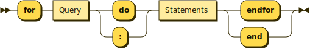
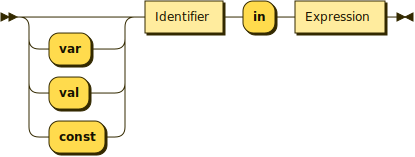

# For Syntax

## Overview

The expression:
<pre><code>
for _variable_ in _expression_ do _actions_ endfor
</code></pre>
evaluates the expression, which should yield an iterable object, like a list, and then performs the actions with the variable being successively bound to each element in turn
```
for x in ['a', 'b', 'c'] do showMe( x ) endfor
### Will print
"a"
"b"
"c"
```

To iterate across a range of numbers use a [ranged-list](ranges.md). For example, to add the numbers from 1 to 10 you would iterate across `[1 ... 10]`:
```
var total = 0
for i from [1 ... 10]:
    total <- total + i
endfor
println( total )
### Prints: 55
```


## Technical Summary

The for-loop iterates over a set of statements by finding every possible binding to the loop-condition. At the time of writing the only loop-condition is:

* <code> _variable_ in _expression_ </code>, which binds the given variable to each value produced by streaming from a snapshot of the given expression. 

### Grammar


```
LoopExpression ::= 
    'for' Query ('do'|':') Statements ('endfor'|'end')
```


```
Query ::= 
    ('var' | 'val' | 'const')? Identifier 'in' Expression
```