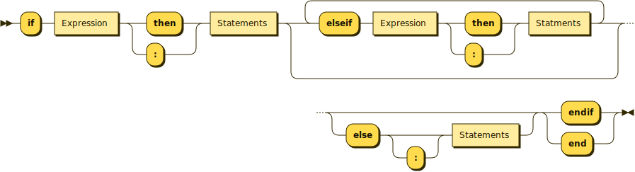

# If Syntax

## Overview

`if` is the first word of a conditional expression and must be matched by a 
corresponding `end` or `endif`. For example:
```
    if tough(steak) then
        fry(steak)
    else
        grill(steak)
    endif
```

When this code is executed, the Nutmeg runner first executes the
condition (i.e. `tough(steak)`).  If this evaluates to `false` then
`grill(steak)` is executed, otherwise `fry(steak)` is executed. The full
syntax of allowable conditional commands is quite complex.  An `if`
statement has the form:
<pre><code>
    if <i>CONDITION</i> then 
        <i>CONSEQUENT</i>
    elseif <i>CONDITION</i> then 
        <i>CONSEQUENT</i>
    ...
    <i>[any number of additional </i>elseif<i> ... </i>then<i> ... clauses]</i>
    ...
    else
        <i>CONSEQUENT</i>
    endif
</code></pre>
The <code>else <i>CONSEQUENT</i></code> can be omitted if desired. The <code>elseif
<i>CONDITION</i> then <i>CONSEQUENT</i></code> can be either omitted or repeated as many
times as required.  A <i>`CONDITION`</i> is any expression, and a <i>`CONSEQUENT`</i>
is any sequence of Nutmeg statements.

The condition should, when executed, produce a result. If the result is
`false`, then the corresponding consequent is ignored, and the program
moves on to the next `elseif`, or if there isn't one, to the `else`
clause. If there is no `elseif` or `else`, then the program moves on to
the code following the `endif`.

If the result of executing a condition is anything other than `true` or 
`false`, then an error is raised.

`if` statements can be nested inside one another, i.e. a <i>`CONDITION`</i> or a
<i>`CONSEQUENT`</i> of an `if` statement may itself contain `if` statements.
For example:
```
    if isnumber(n) then
        if n > 0 then
            'positive'
        else
            'less than or equal to zero'
        endif
    endif
```
It is permissible, but unusual, for a <i>`CONSEQUENT`</i> to contain no code at
all, for example:
```
    def printList( list );
        if list.isEmpty then
        else
            println( head(list) )
            printList( tail(list) )
        endif
    enddef
```

## Technical Summary

The `if` syntax is used to conditionally execute statements.

```
IfExpression ::= 
    'if' Expression ('then'|':') Statements 
    ( 'elseif' Expression ('then'|':') Statements )* ('else' ':'? Statements)? 
    ('endif'|'end')
```


* The conditions are evaluated in order and must evaluate to true or false. As soon as a condition evaluates to true the matching action is evaluated and then the statement finishes. If no conditions match then the default action, if provided, is evaluated and the statement finishes.
* The `Statements` of an if-statement introduce their own lexical scopes that enclose the statement and no more. This ensures that variables introduced by the statements are only in scope where their definition is guaranteed to be executed.

