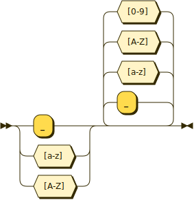
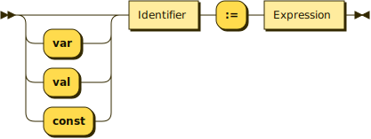

# Variables

## Summary

In Nutmeg, variables are a way of naming objects. You can use any name for
a variable that starts with a letter or underscore and then continues with 
letters, digits and underscores.
```
Identifier ::= [_a-zA-Z] [_a-zA-Z0-9]*
```


Variables are both declared and given their initial value at the same time 
using a _binding_ statement. Bindings look like this.
```
Binding ::= ('var'|'val'|'const')? Identifier ':=' Expression
```


The initial optional modifier is one of `var`, `val` or `const`. The `var` 
modifier allows subsequent assignments but limits the variable to a single 
procedure and cannot be used for top-level variables. The `val` modifier,
which is the default when no explicit modifier is supplied, disallows
subsequent assignments. And the `const` modifier not only disallows 
assignment but requires that the initial value is recursively immutable.

Once a variable has been bound, it can be used in any expression and
evaluates to the single bound value. 

## Overview of Bindings

In Nutmeg, variables must be given an initial value before they can be
used. We say that this _binds_ the variable to their starting value. After
that point variables act as a shortcut way of referring to their bound
value. For example, we can bind the variable `poem` to the string `"one, two, buckle my shoe"` and then check to see if the `poem` starts with the string `"on"`.
```
poem = "one, two, buckle my shoe"
println( poem.startsWith( "on" ) )    ### prints true
```

When a binding occurs at the top-level, i.e. not inside a procedure, the 
variable it introduces has
[global scope](scopes) and can be referenced from every part of your program. 
By contrast, variables that are bound inside a procedure are not visible 
outside the procedure. In fact they are typically limited to just the 
local statements that follow, which is the [local scope](scopes). For 
this section we can simplify a little and 
treat procedures and local scope as the same<sup id="a1">[1](#f1)</sup>. 
```
var corners = 4     ### The corners variable is global, visible everywhere.
def hello() =>>     ### hello is another global variable.
    ### The message variable is local and visible inside the procedure.
    message := "corners of a square: "   
    println( message, corners )
enddef
```

**Important note** for programmers from other languages like Python: global
variables in Nutmeg are nonassignable. In other words, they keep their initial
value throughout the lifetime of the program. If you think you really need an
assignable top-level variable, see [references](references).

## Modifiers

Not all variables are the same in Nutmeg. You can alter the permitted
capabilities of a variable by using a modifier. There are three modifiers, `var`, `val` and `const`, and these are each described in their own sections below.

### Assignable Variables: `var`

Variables can be declared as `var`, which allows them to be used in assignments. Assignments change the value that a variable is bound to and are written like this:
```
x <- "my new value"
```
Assignments allows you to write procedural code like this, for example:
```
def factorial( n ) =>>
    var sofar = 1;
    for i in [1 ..< n] do
        sofar <- sofar * i
    endfor
enddef
```
However, `var` is limited to locally declared variables only. Global variables never change their values after they are initially set. Another restriction is that `var` variables cannot be declared in one procedure and then referenced in a nested procedure.
```
### Not allowed
var count_registrations = 0; ### Globals cannot be vars!

### And this is not allowed either.
def counter() =>>
    var n = 0
    lambda:
        n               
        n <- n + 1      ### No! Defined in an outer procedure.
    endlambda
enddef
```
Why does Nutmeg make these restrictions, especially when other language do not? Well, by imposing these restrictions, we make it possible to use assignments when writing functional rather than procedural code. And the thrust of Nutmeg is to make it possible to neatly and safely blend functional and imperative programming.

### Nonassignable Variables: `val`

### Constants: `const`


# Footnotes
<b id="f1">1</b> However, within a procedure 
there are usually lots of smaller, nested scopes. Follow the link for more 
details on scopes. [↩](#a1)